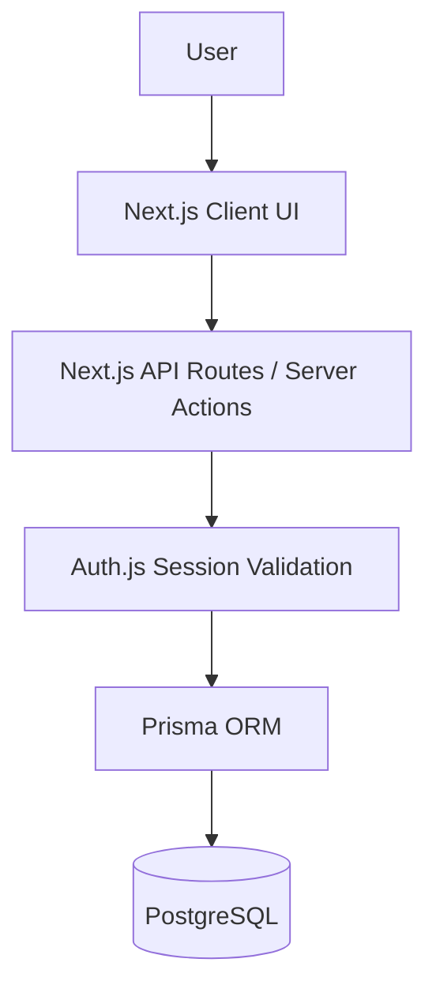

# TaskFlow

TaskFlow is a robust, full-stack task management web application built to help users seamlessly organize and track their daily responsibilities. It provides a highly responsive, secure, and professional environment for authenticated users to create, manage, filter, and monitor their tasks through a meticulously designed dashboard.

## Features

- **User Registration and Authentication**: Secure account creation and login system.
- **Protected Dashboard**: Only authenticated users can access their dashboard.
- **Secure Session-Based Authorization**: Users are strictly isolated to viewing and modifying only their own tasks.
- **Comprehensive Task Management**: Create, view, edit, delete, and complete/uncomplete tasks instantly.
- **Task Priorities & Due Dates**: Track tasks chronologically or by level of urgency (Low, Medium, High).
- **Advanced Searching & Filtering**: Find tasks via real-time text search, status filters, and priority filters.
- **Dynamic Sorting**: Order tasks by creation date, due date, or priority.
- **Dashboard Statistics**: Instant overview of total tasks, pending, completed, high priority, and overdue items.
- **Responsive Design**: Flawless layout adaptation across desktop, tablet, and mobile devices.
- **Light/Dark Mode**: First-class support for both themes with preserved user preferences.
- **Form Validation**: Strict client-side and server-side input validation.

## Tech Stack

| Technology | Purpose |
|------------|---------|
| **Next.js 16** | Core React framework for Server Components, Server Actions, and routing. |
| **React 19** | UI library for building interactive frontend components. |
| **TypeScript** | Strict static typing for end-to-end type safety. |
| **Tailwind CSS v4** | Utility-first CSS framework for semantic design and responsive layouts. |
| **Prisma** | Modern ORM for defining the database schema and executing type-safe queries. |
| **PostgreSQL (Neon)** | Highly scalable, serverless relational database. |
| **Auth.js (NextAuth v5)** | Secure session management, authentication, and password verification. |
| **Zod** | Schema validation for forms and API requests. |
| **React Hook Form** | Performant, flexible, and extensible forms with easy-to-use validation. |
| **bcryptjs** | Cryptographic hashing for secure password storage. |
| **Lucide React** | Clean, consistent, and accessible SVG icon library. |
| **next-themes** | Persistent dark/light mode context provider. |

## Architecture

TaskFlow utilizes a modern, server-first Next.js architecture leveraging App Router conventions.



- **Authentication & Authorization**: The application uses Auth.js (NextAuth) for session tracking. Server-side checks are injected into every sensitive API route. Tasks are strictly bound to the authenticated `session.user.id`, meaning it is cryptographically impossible to query or modify another user's task. Client-supplied IDs are completely ignored.
- **Data Mutability**: Operations like task creation, updates, and deletions flow through protected REST API routes (`src/app/api/tasks`). 
- **Client-Side Derivation**: The Dashboard requests the raw task array once on load. Advanced operations (Search, Filter, Sort, and Statistics computation) occur entirely on the client side without issuing redundant database queries, providing a lightning-fast UX.

## Project Structure

```
├── prisma/
│   └── schema.prisma           # Database models (User, Task)
├── src/
│   ├── app/
│   │   ├── api/
│   │   │   ├── auth/           # Auth.js and registration endpoints
│   │   │   └── tasks/          # RESTful task endpoints
│   │   ├── dashboard/          # Protected dashboard view
│   │   ├── login/              # Authentication view
│   │   ├── register/           # Account creation view
│   │   ├── globals.css         # Semantic design tokens and Tailwind config
│   │   └── layout.tsx          # Root layout with ThemeProvider
│   ├── components/             # Reusable UI components
│   │   ├── TaskList.tsx        # Central task orchestration and state
│   │   ├── TaskCard.tsx        # Individual task UI with inline edit/delete
│   │   ├── TaskFilters.tsx     # Search, filter, and sort controls
│   │   ├── TaskStats.tsx       # Derived statistics visualizer
│   │   └── ThemeProvider.tsx   # next-themes integration
│   └── auth.ts                 # Auth.js core configuration
```

## Database Schema

The PostgreSQL database relies on two highly-relational models:

1. **User**: Stores the user's `id`, `name`, `email`, and securely hashed `password`.
2. **Task**: Contains `title`, `description`, `status` (TODO/DONE), `priority` (LOW/MEDIUM/HIGH), and `dueDate`. 

A strict one-to-many relationship links `User` to `Task`. If a `User` is deleted, the `onDelete: Cascade` constraint securely wipes their associated tasks.

## Authentication & Security

- **Password Hashing**: User passwords are encrypted with `bcrypt` during registration. Passwords are never stored as plaintext.
- **Authenticated Sessions**: Sensitive pages (`/dashboard`) leverage server-side authentication checks that forcibly redirect unauthorized requests to `/login`.
- **Validation**: All incoming API requests and form submissions are rigorously scrutinized using Zod schemas.
- **Hardened API**: All endpoints strictly query the database using the internal `session.user.id`. Modifying client payload requests to inject fake user IDs is impossible.

## API Documentation

The following RESTful endpoints power the dashboard:

- **`GET /api/tasks`**: Retrieves all tasks belonging to the authenticated user.
- **`POST /api/tasks`**: Creates a new task. Requires a valid title. 
- **`PATCH /api/tasks/[id]`**: Updates a task (title, description, status, priority, or due date). Ensures the task exists and is owned by the requester.
- **`DELETE /api/tasks/[id]`**: Permanently deletes a task after verifying ownership.

*(All task endpoints require an active Auth.js session and return `401 Unauthorized` otherwise.)*

## Getting Started

### 1. Clone Repository
```bash
git clone https://github.com/Atharvvvvvv/Task-Management-WebApp.git
cd Task-Management-WebApp
```

### 2. Install Dependencies
```bash
npm install
```

### 3. Configure Environment Variables
Create a `.env` file in the root directory:
```env
DATABASE_URL=
NEXTAUTH_SECRET=
NEXTAUTH_URL=
```

### 4. Database Setup
Ensure you have a PostgreSQL instance running (e.g., Neon).
```bash
npx prisma db push
npx prisma generate
```

### 5. Start Development Server
```bash
npm run dev
```

## Environment Variables

| Variable | Purpose |
|---|---|
| `DATABASE_URL` | Connection string for your PostgreSQL database. |
| `NEXTAUTH_SECRET` | A secure, random string used by Auth.js to encrypt session tokens. |
| `NEXTAUTH_URL` | The base URL of your application (e.g., `http://localhost:3000`). |

## Usage

1. **Register**: Navigate to the home page or `/register` to create an account.
2. **Log In**: Use your credentials to securely access your dashboard.
3. **Manage Tasks**: Click "New Task" to create a task, assign a priority, and set a due date.
4. **Organize**: Use the horizontal toolbar to search text, filter by status/priority, or sort your tasks.
5. **Edit & Delete**: Hover over any task card to reveal the inline edit (pencil) and delete (trash) controls.
6. **Dark Mode**: Toggle the Moon/Sun icon in the header to switch visual themes instantly.

## Design & UX

TaskFlow implements a highly deliberate, semantic design token architecture heavily inspired by modern productivity software. It completely eschews generic gradients and glassmorphism in favor of a clean, high-contrast, accessible interface that looks professional in both Light and Dark modes.

## Development

```bash
# Run the local development server
npm run dev

# Run a strict TypeScript compiler check
npx tsc --noEmit

# Build the application for production
npm run build
```

## Deployment

TaskFlow is fully production-ready and optimized for deployment on Next.js-compatible serverless platforms such as **Vercel**. When deploying, ensure that your `DATABASE_URL` points to your production PostgreSQL database and a strong `NEXTAUTH_SECRET` is generated in your deployment's environment settings.

## Future Improvements
- Pagination for massively scaled task collections.
- Drag-and-drop KanBan board task ordering.
- Real-time updates with WebSockets.
- Automated Cypress end-to-end tests.

---
<!-- Add dashboard screenshot here -->
